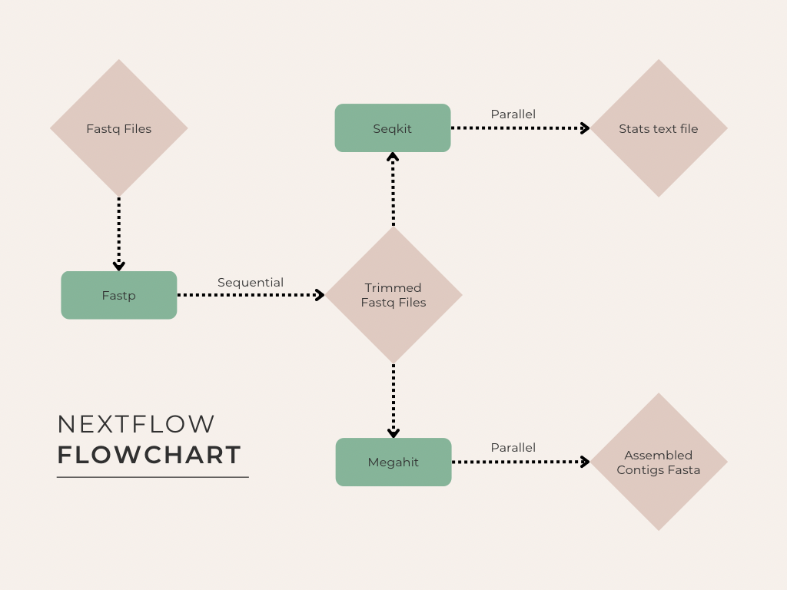

# 🧬🦠 BIOL7210 Genomics Workflow

**Author:** Sanya Badole  
**Course:** BIOL7210  
**Assignment:** Nextflow DSL2 Workflow (Sequential + Parallel)  
**GitHub Repo:** https://github.com/sanyabadole/Nextflow_Exercise

---

### Workflow Summary

This Nextflow pipeline demonstrates a basic **genomic preprocessing and assembly workflow** using the following tools:

- `fastp`: read trimming and QC (sequential first step)
- `megahit`: genome assembly (parallel)
- `seqkit`: read stats (parallel)

The workflow uses **Nextflow DSL2**, supports Docker, and is fully runnable on a local machine or WSL2.

---

### Key Features

- ✅ Sequential processing: `fastp` → `megahit`
- ✅ Parallel processing: `fastp` → `megahit` and `seqkit`
- ✅ Containerized with Docker
- ✅ Test data included
- ✅ Runtime < 30 minutes

---

### Requirements

| Dependency        | Version                                  |
|-------------------|------------------------------------------|
| **Nextflow**      | 24.10.5 build 5935                       |
| **Docker**        | Docker version 28.0.1, build 068a01e     |
| **OS Tested**     | MacOS 14.4.1 (ARM64) / WSL2 Ubuntu 22.04 |
| **Architecture**  | ARM64 / x86_64                           |
 
---

### Repo Structure

```
Nextflow_Exercise/
├── main.nf                 # Main Nextflow pipeline script
├── nextflow.config         # Pipeline configuration (Docker containers, resources, profiles)
├── README.md               # Project documentation and usage instructions
├── workflow_diagram.png    # Visual diagram showing workflow structure
└── test_data/              # Small example dataset used for testing
   ├── ecoli_demo_R1.fastq.gz
   └── ecoli_demo_R2.fastq.gz

```
### Test Data

**Included** in `test_data/` are truncated (~4,000 lines) paired-end FASTQ files suitable for fast runtime.
Total runtime with test data: ~3–5 minutes

---

### How to Run

```bash
# Step 1: Create environment with nextflow
conda create -n nf -c bioconda nextflow -y && conda activate nf

# Step 2: Clone the repo
git clone git@github.com:sanyabadole/Nextflow_Exercise.git && cd Nextflow_Exercise

# Step 3: Run the workflow using Docker
nextflow run main.nf \
  --reads 'test_data/*_{R1,R2}.fastq.gz' \
  --outdir results \
  -profile docker
```
‼️ Note - Make sure you install and run docker before executing this command

---

### Output directory structure

```
results/
├── fastp/
│   |── *_trimmed_R1.fastq.gz
|   └── *_trimmed_R2.fastq.gz
├── assembly/
│   └── *_megahit_contigs.fasta
└── stats/
    └── *_read_stats.txt
```
---

### Workflow Diagram

